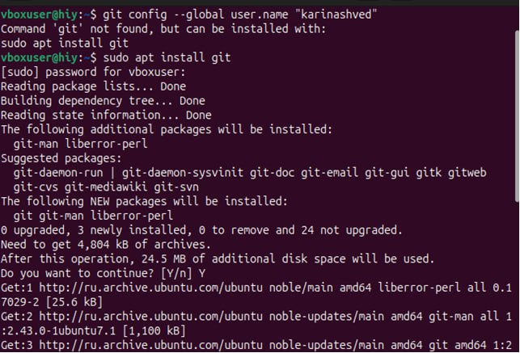
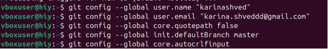
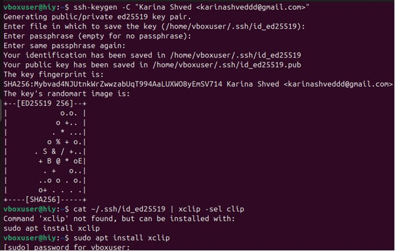
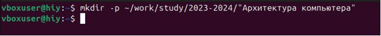
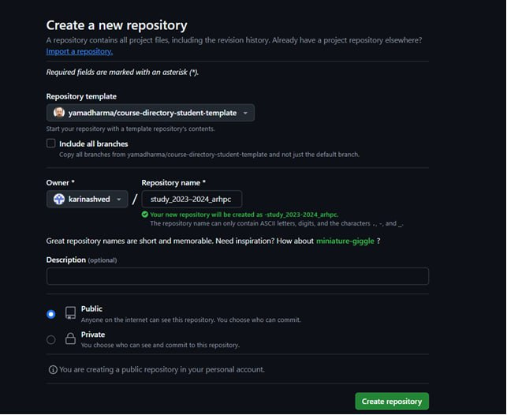
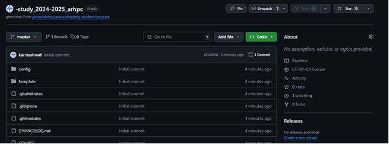
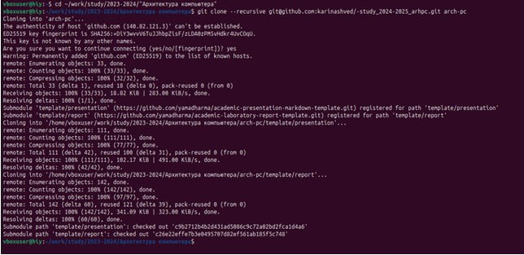
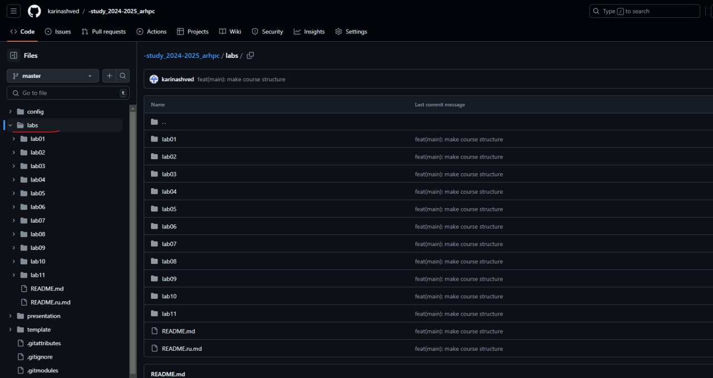

---
## Front matter
title: "Отчёт по лабораторной работе №2"
subtitle: "дисциплина: Архитектура компьютера"
author: "Швед Карина НММ-04-2024"

## Generic otions
lang: ru-RU
toc-title: "Содержание"

## Bibliography
bibliography: bib/cite.bib
csl: pandoc/csl/gost-r-7-0-5-2008-numeric.csl

## Pdf output format
toc: true # Table of contents
toc-depth: 2
lof: true # List of figures
lot: true # List of tables
fontsize: 12pt
linestretch: 1.5
papersize: a4
documentclass: scrreprt
## I18n polyglossia
polyglossia-lang:
  name: russian
  options:
	- spelling=modern
	- babelshorthands=true
polyglossia-otherlangs:
  name: english
## I18n babel
babel-lang: russian
babel-otherlangs: english
## Fonts
mainfont: IBM Plex Serif
romanfont: IBM Plex Serif
sansfont: IBM Plex Sans
monofont: IBM Plex Mono
mathfont: STIX Two Math
mainfontoptions: Ligatures=Common,Ligatures=TeX,Scale=0.94
romanfontoptions: Ligatures=Common,Ligatures=TeX,Scale=0.94
sansfontoptions: Ligatures=Common,Ligatures=TeX,Scale=MatchLowercase,Scale=0.94
monofontoptions: Scale=MatchLowercase,Scale=0.94,FakeStretch=0.9
mathfontoptions:
## Biblatex
biblatex: true
biblio-style: "gost-numeric"
biblatexoptions:
  - parentracker=true
  - backend=biber
  - hyperref=auto
  - language=auto
  - autolang=other*
  - citestyle=gost-numeric
## Pandoc-crossref LaTeX customization
figureTitle: "Рис."
tableTitle: "Таблица"
listingTitle: "Листинг"
lofTitle: "Список иллюстраций"
lotTitle: "Список таблиц"
lolTitle: "Листинги"
## Misc options
indent: true
header-includes:
  - \usepackage{indentfirst}
  - \usepackage{float} # keep figures where there are in the text
  - \floatplacement{figure}{H} # keep figures where there are in the text
---

# Цель работы

Целью работы является изучить идеологию и применение средств контроля версий.
Приобрести практические навыки по работе с системой git.

# Ход работы

Я создала учётную запись на сайте https://github.com/ и заполнила основные данные.
Сначала я загрузила все основные пакеты

{#fig:001 width=70% height=70%}

Перехожу к базовой настройке git
Я открыла терминал, задала свое имя и email, кодировку и другие параметры

{#fig:002 width=70% height=70%}
{#fig:003 width=70% height=70%}

Для последующей идентификации пользователя на сервере репозиториев я ввела
команду ssh-keygen -C и сгенерировала пару ключей (приватный и открытый).
Сгенеренный открытый ключ я загрузила на сайте github.com, скопировав его из
локальной сети в буфер обмена

{#fig:004 width=70% height=70%}
{#fig:005 width=70% height=70%}

Далее я открыла терминал и создала каталог для предмета «Архитектура компьютера»

{#fig:006 width=70% height=70%}

Далее я создала репозиторий через web-интерфейс github. Я перешла на станицу
репозитория с шаблоном курса и использовала шаблон. Затем я задала имя
репозитория study_2024-2025_arh-pc и создала его. Открыв терминал, я перешла в
каталог курса и клонировала репозиторий

{#fig:007 width=70% height=70%}
{#fig:008 width=70% height=70%}
{#fig:009 width=70% height=70%}

Далее я перешла в каталог курса и удалила лишние файлы с помошью команды rm
package.json, затем создала необходимые каталоги с помощью команд echo arch-pc > COURSE и
make и отправила файлы на сервер.
Проверила правильность создания иерархии рабочего пространства в локальном
репозитории и на странице github 

{#fig:010width=70% height=70%}

# Выводы

Я изучила идеологию и применение средств контроля версий, а также приобрела
практические навыки по работе с системой git.
