---
## Front matter
title: "Отчёт по лабораторной работе №3"
subtitle: "Дисциплина: Архитектура компьютера"
author: "Швед Карина НММ-04-2-24"

## Generic otions
lang: ru-RU
toc-title: "Содержание"

## Bibliography
bibliography: bib/cite.bib
csl: pandoc/csl/gost-r-7-0-5-2008-numeric.csl

## Pdf output format
toc: true # Table of contents
toc-depth: 2
lof: true # List of figures
lot: true # List of tables
fontsize: 12pt
linestretch: 1.5
papersize: a4
documentclass: scrreprt
## I18n polyglossia
polyglossia-lang:
  name: russian
  options:
	- spelling=modern
	- babelshorthands=true
polyglossia-otherlangs:
  name: english
## I18n babel
babel-lang: russian
babel-otherlangs: english
## Fonts
mainfont: IBM Plex Serif
romanfont: IBM Plex Serif
sansfont: IBM Plex Sans
monofont: IBM Plex Mono
mathfont: STIX Two Math
mainfontoptions: Ligatures=Common,Ligatures=TeX,Scale=0.94
romanfontoptions: Ligatures=Common,Ligatures=TeX,Scale=0.94
sansfontoptions: Ligatures=Common,Ligatures=TeX,Scale=MatchLowercase,Scale=0.94
monofontoptions: Scale=MatchLowercase,Scale=0.94,FakeStretch=0.9
mathfontoptions:
## Biblatex
biblatex: true
biblio-style: "gost-numeric"
biblatexoptions:
  - parentracker=true
  - backend=biber
  - hyperref=auto
  - language=auto
  - autolang=other*
  - citestyle=gost-numeric
## Pandoc-crossref LaTeX customization
figureTitle: "Рис."
tableTitle: "Таблица"
listingTitle: "Листинг"
lofTitle: "Список иллюстраций"
lotTitle: "Список таблиц"
lolTitle: "Листинги"
## Misc options
indent: true
header-includes:
  - \usepackage{indentfirst}
  - \usepackage{float} # keep figures where there are in the text
  - \floatplacement{figure}{H} # keep figures where there are in the text
---

# Цель работы

Целью работы является освоение процедуры оформления отчетов с помощью
легковесного языка разметки Markdown.

# Ход работы

При выполнении лабораторной работы я установила следующее ПО (pandoc и
TexLive) (рис. [-@fig:001]).

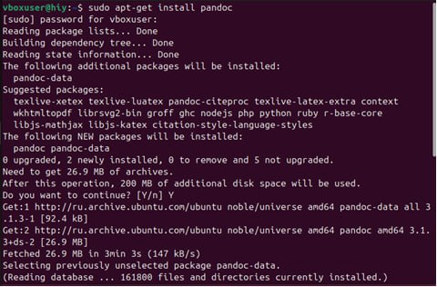 {#fig:001 width=70% height=70%}
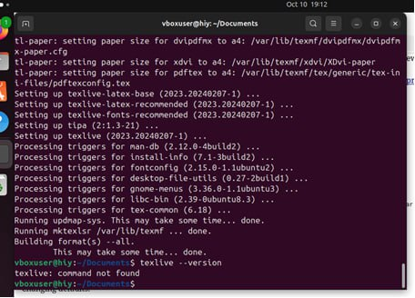 {#fig:002 width=70% height=70%}

Далее я с помощью терминала перешла в каталог курса сформированный при
выполнении лабораторной работы №2 и обновила локальный репозиторий, скачав
изменения из удаленного репозитория с помощью команды git pull

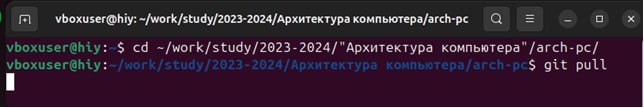 {#fig:003 width=70% height=70%}

 Я перешла в каталог с шаблоном отчета по лабораторной работе № 3 и провела
компиляцию шаблона с использованием Makefile. Для этого ввела команду make

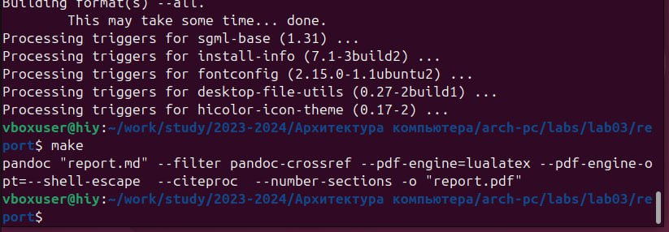 {#fig:004 width=70% height=70%}

У меня сгенерировались файлы report.pdf и report.docx. Я открыла и проверила
корректность полученных файлов

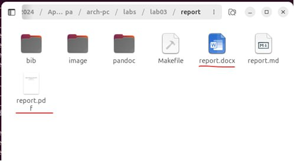 {#fig:005 width=70% height=70%}

Далее я удалила полученные файлы с использованием Makefile с помощью команды
make clean и проверила, что после этой команды файлы report.pdf и report.docx были
удалены

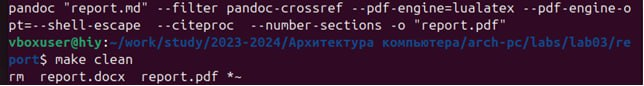 {#fig:006 width=70% height=70%}
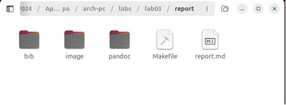 {#fig:007 width=70% height=70%}

Я открыла файл report.md c помощью текстового редактора и внимательно изучила
структуру этого файла

 {#fig:008 width=70% height=70%}
 {#fig:009 width=70% height=70%}
 {#fig:010 width=70% height=70%}

Далее я заполнила отчет и скомпилировала его с использованием Makefile. Проверила
корректность полученных файлов

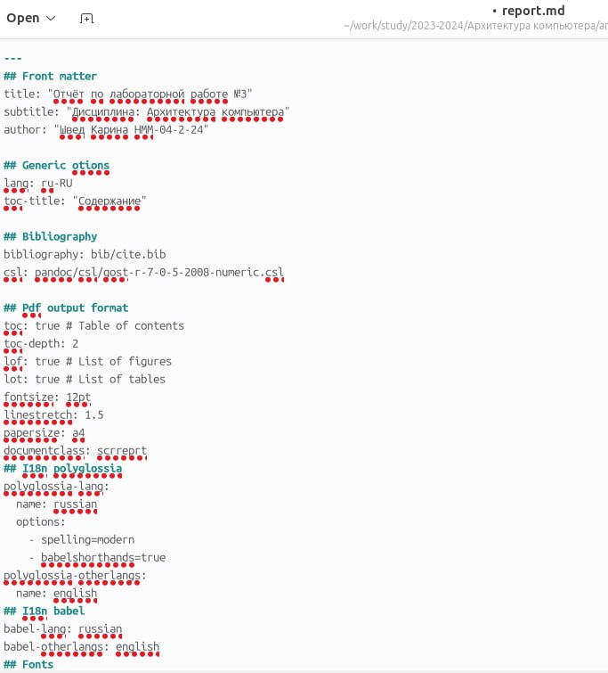 {#fig:011 width=70% height=70%}
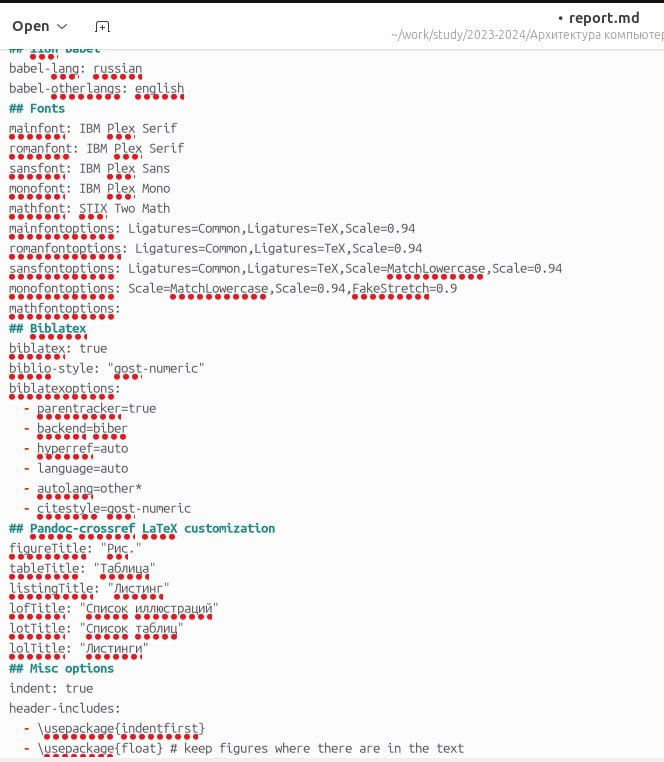 {#fig:012 width=70% height=70%}
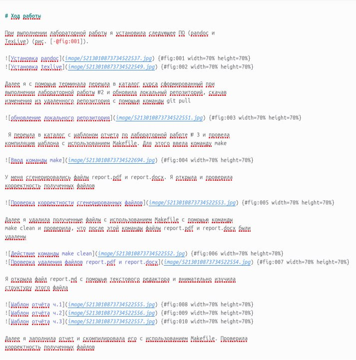 {#fig:013 width=70% height=70%}

Я сделала самостоятельное задание: заполнила отчет в формате Markdown для лабораторной работы № 2

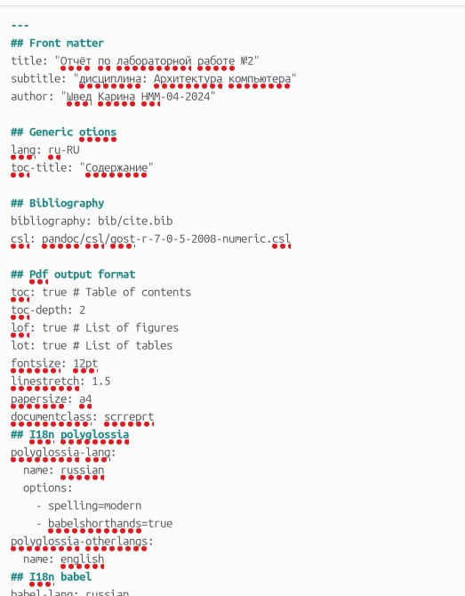 {#fig:014 width=70% height=70%}
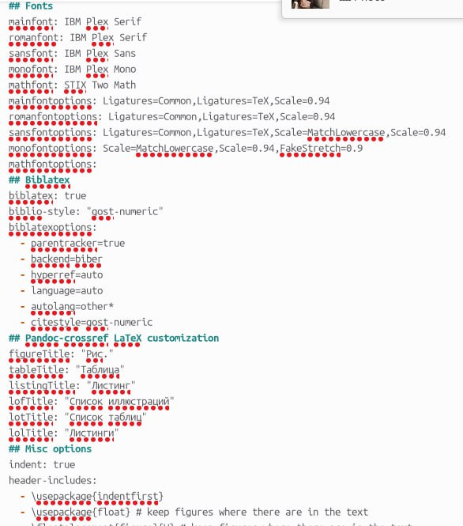 {#fig:015 width=70% height=70%}
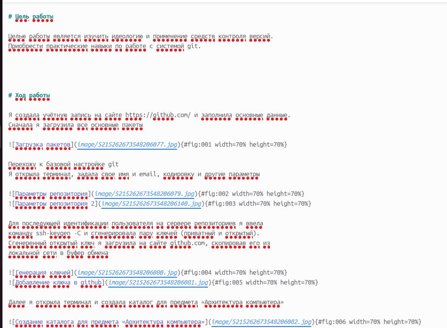 {#fig:016 width=70% height=70%}
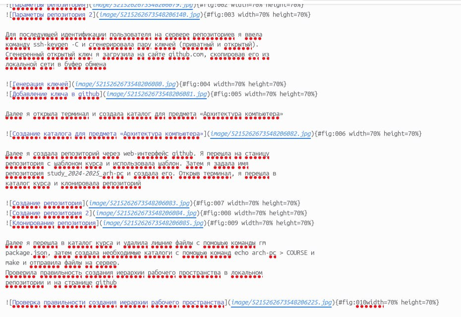 {#fig:017 width=70% height=70%}
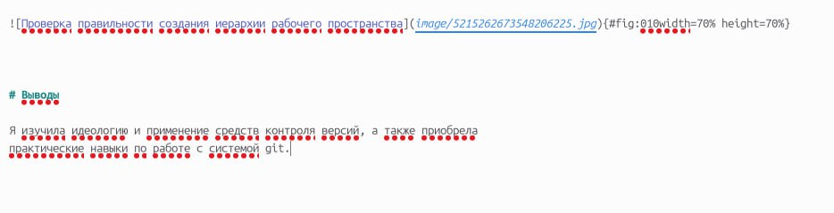 {#fig:018 width=70% height=70%}

 Сделала компиляцию отчета и загрузила файлы на GitHub
 
 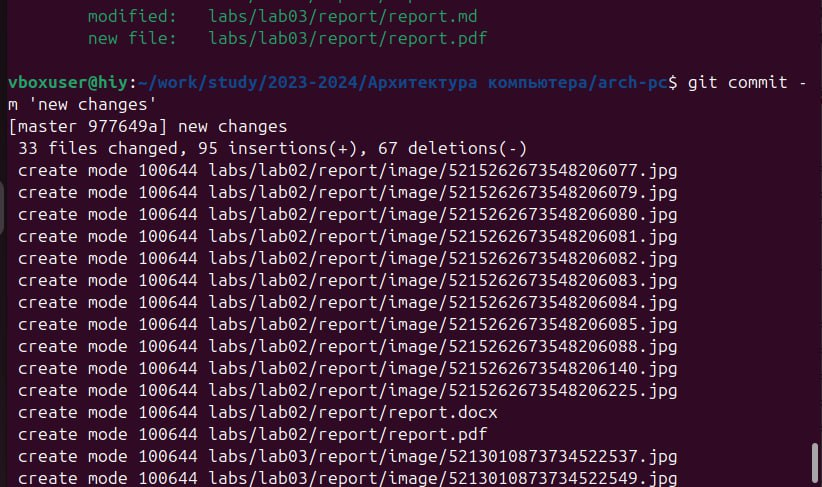 {#fig:018 width=70% height=70%}
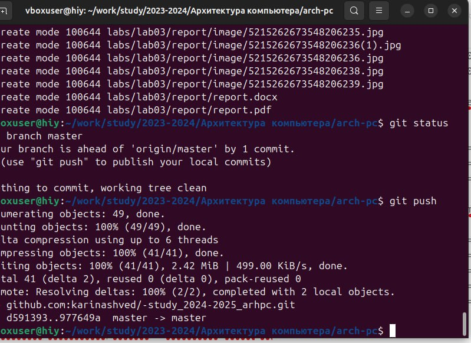 {#fig:019 width=70% height=70%}
 

# Выводы
Я  освоила процедуры оформления отчетов с помощью легковесного языка разметки Markdown

